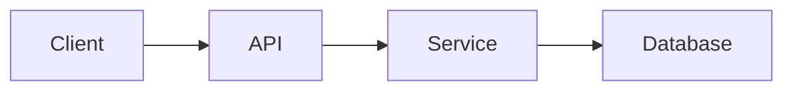

# README Architect

## Objectivo

Transformar o README.md de um projecto GitHub numa documentação profissional, clara e tecnicamente fiável.

A skill deve comportar-se como um arquitecto de documentação técnica, não como um simples formatador de Markdown.

O princípio central é:

> **Documentar aquilo que o repositório demonstra, sem inventar informação.**

## Fluxo de trabalho

Executar sempre que possível nesta ordem:

1. Inspeccionar o README.md existente.
2. Inspeccionar a estrutura do repositório.
3. Identificar a stack tecnológica.
4. Detectar versões a partir dos ficheiros reais.
5. Identificar scripts e comandos disponíveis.
6. Identificar variáveis de ambiente.
7. Identificar testes.
8. Identificar CI/CD.
9. Identificar deployment.
10. Identificar licença.
11. Auditar o README actual.
12. Definir a nova arquitectura documental.
13. Gerar badges.
14. Gerar ou actualizar diagramas Mermaid quando úteis.
15. Reescrever o README.
16. Validar o resultado contra o próprio repositório.
17. Apresentar um resumo das alterações e eventuais informações que não puderam ser verificadas.

## Regra de não invenção

Nunca inventar:

- versões;
- dependências;
- funcionalidades;
- endpoints;
- comandos;
- variáveis de ambiente;
- URLs;
- métricas;
- screenshots;
- cobertura de testes;
- serviços cloud;
- arquitectura;
- estado de produção;
- licenças;
- modelos de IA.

Quando uma informação não puder ser confirmada, deve ser:

- omitida; ou
- claramente marcada como pendente.

Nunca utilizar placeholders como informação final, por exemplo:

`YOUR_API_KEY`
`your-username`
`your-project`
`example.com`

excepto dentro de uma secção explicitamente dedicada à configuração de exemplo.

## Auditoria inicial

Produzir internamente uma análise com:

### Estrutura

- presença de título;
- descrição;
- badges;
- demonstração;
- funcionalidades;
- instalação;
- configuração;
- utilização;
- testes;
- arquitectura;
- estrutura do projecto;
- deployment;
- contribuição;
- licença;
- roadmap.

### Qualidade técnica

Verificar:

- comandos contra `package.json`, `pyproject.toml`, `Makefile`, scripts e configuração;
- versões contra os ficheiros de dependências;
- paths contra a árvore do projecto;
- variáveis contra `.env.example`, código e configuração;
- comandos Docker contra `Dockerfile` e `docker-compose.yml`;
- workflows contra `.github/workflows`;
- licença contra `LICENSE` ou `LICENSE.md`.

## Score

Calcular um score interno de 0 a 100.

Critérios:

| Área | Peso |
|---|---:|
| Clareza do projecto | 15 |
| Estrutura documental | 15 |
| Instalação e configuração | 15 |
| Utilização | 10 |
| Stack e versões | 10 |
| Arquitectura | 10 |
| Qualidade visual | 10 |
| Testes e qualidade | 5 |
| Deployment | 5 |
| Contribuição e licença | 5 |

Apresentar, quando solicitado, o score antes e depois.

## Estrutura recomendada

A estrutura deve ser adaptada ao projecto. Não criar secções vazias.

Ordem preferencial:

```text
# Project Name

Short project description

Badges

Optional hero image / demo

## Overview

## Features

## Tech Stack

## Architecture

## Getting Started

### Prerequisites

### Installation

### Configuration

### Usage

## Testing

## Project Structure

## API

## Deployment

## Roadmap

## Contributing

## License
```

Eliminar secções que não tenham conteúdo útil.

## Hero

Quando existir uma imagem ou demonstração real, pode ser colocada perto do topo.

Não criar imagens fictícias.

Pode utilizar:

```html
<p align="center">
  
</p>
```

Quando o projecto for essencialmente uma biblioteca, CLI ou ferramenta técnica, preferir uma apresentação textual limpa em vez de uma imagem decorativa.

## Badges segmentados

O estilo visual preferencial é inspirado em badges segmentados profissionais:

```text
┌──────────┬────────┐
│  PYTHON  │  3.12+ │
└──────────┴────────┘
```

Usar Shields.io quando apropriado.

Template:

```markdown
<p align="center">
  
  
</p>
```

### Regras dos badges

- Preferir `style=flat-square`.
- Usar texto em maiúsculas na etiqueta.
- Usar logos oficiais quando disponíveis.
- Manter dimensões e espaçamento consistentes.
- Não exagerar no número de badges.
- Priorizar tecnologias relevantes.
- Incluir versões apenas quando verificadas.
- Usar badges de estado, CI, licença ou cobertura apenas quando a origem puder ser confirmada.
- Não criar badges para tecnologias que apenas aparecem em documentação ou comentários sem utilização demonstrável.

### Categorias

Prioridade:

1. Linguagem principal.
2. Framework principal.
3. Runtime ou plataforma relevante.
4. Base de dados.
5. IA/modelo principal.
6. Testes.
7. CI/CD.
8. Deployment.
9. Licença.

Exemplo:

```markdown
<p align="center">


</p>
```

Não copiar estes valores para projectos diferentes. Detectá-los.

## Paleta dos badges

Quando for necessário criar badges personalizados, preferir cores associadas à tecnologia.

Exemplos:

- Python: `3776AB`
- Flask: `000000`
- FastAPI: `009688`
- PostgreSQL: `4169E1`
- Docker: `2496ED`
- Node.js: `339933`
- React: `61DAFB`
- TypeScript: `3178C6`
- GitHub Actions: `2088FF`
- OpenAI: usar a identidade visual disponível no Shields.io, sem assumir uma cor como facto técnico.

O badge de licença pode utilizar uma cor dourada discreta quando o estilo visual do projecto justificar.

## Descrição

A primeira descrição deve responder rapidamente:

1. O que é?
2. Para quem é?
3. Qual o problema que resolve?
4. Qual a principal característica diferenciadora?

Evitar frases vagas como:

> This is an innovative project that uses cutting-edge technology.

Preferir:

> A local-first Python service that extracts structured data from X and exposes it through a REST API.

## Features

Usar uma lista curta.

Exemplo:

```markdown
## Features

- Fast REST API
- Automatic data validation
- Persistent PostgreSQL storage
- Docker-based development environment
- Automated test suite
```

Não listar funcionalidades apenas planeadas como se já existissem.

Separar funcionalidades futuras no `Roadmap`.

## Tech Stack

Mostrar apenas tecnologias efectivamente utilizadas.

Exemplo:

```markdown
| Layer | Technology |
|---|---|
| Language | Python |
| API | FastAPI |
| Database | PostgreSQL |
| Testing | Pytest |
| Deployment | Docker |
```

## Architecture

Criar Mermaid quando a arquitectura tiver relações que beneficiem de representação visual.

Exemplo:



O diagrama deve reflectir a arquitectura real detectada.

Não criar diagramas ornamentais sem informação.

## Installation

Os comandos devem corresponder aos ficheiros do projecto.

Python:

```bash
git clone <verified-repository-url>
cd <verified-directory>

python -m venv .venv
source .venv/bin/activate
pip install -r requirements.txt
```

Windows, quando relevante:

```powershell
python -m venv .venv
.venv\Scripts\Activate.ps1
pip install -r requirements.txt
```

Node:

```bash
npm install
npm run dev
```

Nunca escrever comandos que não existam ou não sejam compatíveis com o projecto.

## Configuration

Detectar `.env.example`, ficheiros de configuração e variáveis utilizadas.

Apresentar uma tabela:

```markdown
| Variable | Required | Description |
|---|---|---|
| `DATABASE_URL` | Yes | Database connection string |
| `API_KEY` | Yes | API authentication key |
```

Nunca expor secrets.

Nunca colocar valores reais de credenciais.

## Usage

Dar primeiro o caminho mais simples para executar o projecto.

Quando existir uma CLI, API ou aplicação web, incluir exemplos reais.

## API

Só criar documentação de API se existirem endpoints verificáveis.

Para REST:

```markdown
| Method | Endpoint | Description |
|---|---|---|
| GET | `/health` | Health check |
| GET | `/items` | List items |
```

Não inventar endpoints.

## Testing

Detectar framework e comandos.

Exemplos:

```bash
pytest
```

ou:

```bash
npm test
```

Só apresentar o comando correspondente ao projecto.

Não afirmar que os testes passam sem os executar ou sem evidência fornecida.

## Project Structure

Representar apenas paths relevantes.

Exemplo:

```text
project/
├── src/
│   ├── api/
│   ├── services/
│   └── models/
├── tests/
├── .env.example
├── Dockerfile
└── README.md
```

Não gerar árvores gigantescas.

## Deployment

Documentar apenas plataformas detectadas.

Exemplos possíveis:

- Docker
- GitHub Actions
- Vercel
- Netlify
- Cloud Run
- AWS
- Azure

Se apenas existir configuração parcial, dizê-lo explicitamente.

## Roadmap

Separar:

```markdown
### Planned

- Feature not yet implemented
```

de:

```markdown
### Completed

- Feature already implemented
```

Nunca transformar ideias ou TODOs em funcionalidades existentes.

## Contributing

Para projectos públicos, incluir instruções mínimas quando fizer sentido:

```text
Fork
→ Create branch
→ Make changes
→ Run tests
→ Open pull request
```

Não criar regras de contribuição complexas sem evidência no projecto.

## License

Detectar a licença existente.

Se existir `LICENSE`, usar o nome correcto.

Se não existir, não assumir MIT.

## GitHub discoverability

Melhorar a capacidade de compreensão do projecto por:

- GitHub;
- developers;
- recrutadores;
- ferramentas de pesquisa;
- sistemas de IA.

Usar termos técnicos naturais.

Não fazer keyword stuffing.

O nome do projecto, descrição, funcionalidades e stack devem aparecer de forma clara e coerente.

## Estilo editorial

Escrever em inglês por defeito quando o README estiver orientado para uma audiência internacional.

Preservar o idioma existente quando o projecto estiver claramente dirigido a uma audiência local.

Preferir:

- frases curtas;
- linguagem técnica precisa;
- títulos consistentes;
- tabelas quando melhoram a leitura;
- exemplos reais;
- código directamente executável;
- pouco texto decorativo.

Evitar:

- marketing exagerado;
- emojis em excesso;
- frases genéricas;
- secções vazias;
- texto redundante;
- afirmações não verificadas.

## Validação final

Antes de concluir, verificar:

```text
[ ] README.md é Markdown válido
[ ] Título identifica correctamente o projecto
[ ] Descrição corresponde ao projecto
[ ] Badges correspondem ao stack real
[ ] Versões foram verificadas
[ ] Comandos existem ou são coerentes com os scripts reais
[ ] Paths apresentados existem
[ ] Variáveis de ambiente foram verificadas
[ ] Endpoints foram verificados
[ ] Arquitectura corresponde ao código/configuração
[ ] Licença corresponde ao ficheiro existente
[ ] Não existem secrets
[ ] Não existem placeholders acidentais
[ ] Funcionalidades futuras estão separadas
[ ] Não existem secções vazias
[ ] Mermaid representa arquitectura real
```

## Resultado

Quando o trabalho estiver concluído, devolver:

1. README final.
2. Score antes/depois, quando houver README anterior.
3. Resumo das principais melhorias.
4. Itens que ficaram por confirmar.
5. Eventuais ficheiros que deveriam ser actualizados em conjunto, como `.env.example` ou documentação adicional.

## Princípio final

Um README profissional não é o README mais longo.

É aquele que permite a alguém perceber o projecto, instalar, executar, testar e compreender a arquitectura com o mínimo de fricção possível.
